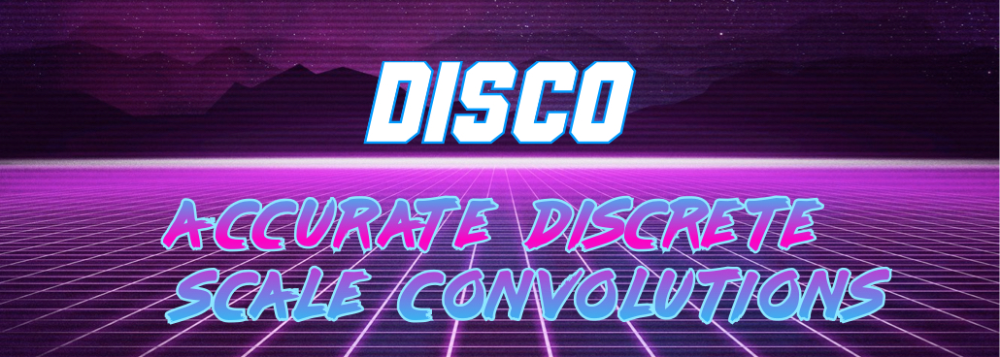
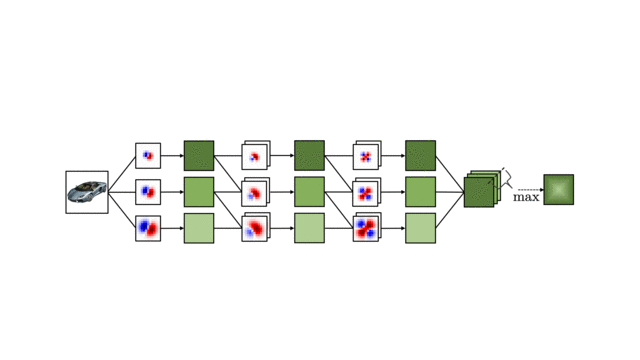

This is the official implementation of

[DISCO: accurate Discrete Scale Convolutions](https://arxiv.org/abs/2106.02733)<br>
**Ivan Sosnovik, Artem Moskalev, and Arnold Smeulders**<br>
BMVC 2021 (**Oral**)

and 

[How to Transform Kernels for Scale-Convolutions](https://openreview.net/forum?id=rTpTF_-fOwm)<br>
**Ivan Sosnovik, Artem Moskalev, and Arnold Smeulders**<br>
ICCV VIPriors 2021


*Scale is often seen as a given, disturbing factor in many vision tasks. When doing so it is one of the factors why we need more data during learning. In recent work scale equivariance was added to convolutional neural networks. We aim for accurate scale-equivariant convolutional neural networks (SE-CNNs). Current SE-CNNs rely on weight sharing and filter rescaling, the latter of which is accurate for integer scales only. To reach accurate scale equivariance, we derive general constraints under which scale-convolution remains equivariant to discrete rescaling. We find the exact solution for all cases where it exists, and compute the approximation for the rest.*

## Scale-Equivariant CNNs


DISCO is a new class of scale-equivariant convolutional neural networks (SE-CNNs).  To learn more about the backbone SE-CNNs we use, check [SESN](https://github.com/ISosnovik/sesn/). To use our models you first need to calculate the DISCO basis. You can do it by simply running 
```bash
python calculate_disco_basis.py \
    --basis_size 5 \ # actual size of the filters
    --basis_effective_size 3 \ # the size of the filter for the conventional CNN
    --basis_scales 1.0 1.41 2.0 \ # the scales hyperparameter for convolutional layers
    --basis_save_dir precalculated_basis \
    --cuda \

```
We provide the bases we have used for our experiments in the `./precalculated_basis` folder.

## Experiments
To reproduce the experiments on Scale-MNIST you first need to generate the datasets. Follow the instructions provided in [SESN](https://github.com/ISosnovik/sesn/). Once the datasets are generated, you can simply run 
```
DATASET_SRC=path/to/datasets bash exp_mnist.sh
```
and for the STL-10 experiments, run
```
DATASET_SRC=path/to/datasets bash exp_stl.sh
```
The experiments on OTB-13 are coming soon


## Acknowledgements
The Robert Bosch GmbH is acknowledged for financial support.

## BibTeX
If you found this work useful in your research, please consider citing
```
@article{sosnovik2021disco,
  title={DISCO: accurate Discrete Scale Convolutions},
  author={Sosnovik, Ivan and Moskalev, Artem and Smeulders, Arnold},
  journal={arXiv preprint arXiv:2106.02733},
  year={2021}
}
```

and 
```
@InProceedings{Sosnovik_2021_ICCV,
    author    = {Sosnovik, Ivan and Moskalev, Artem and Smeulders, Arnold},
    title     = {How To Transform Kernels for Scale-Convolutions},
    booktitle = {Proceedings of the IEEE/CVF International Conference on Computer Vision (ICCV) Workshops},
    month     = {October},
    year      = {2021},
    pages     = {1092-1097}
}
```
